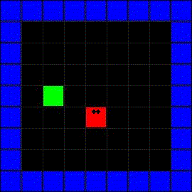

# DQN Snake

PyTorch implementation of DQN algorithm on the game Snake.
The game is written in Pygame.



## Requirements

Python 3.6+, all other libraries used can be found in requirements.txt, and installed using pip.

## Usage

Clone the repo:
```
git clone https://github.com/Stoick01/DQN-Snake.git
```

Create virtual environment, and install libraries:
```
pip install -r requirements.txt
```

To see the model play the game run:
```
python play.py
```

To get the gif run:
```
python gif_out.py
```

To train the model run:
```
python train.py
```

## Parameters

<table>
    <tr>
        <th>Parameter</th>
        <th>Value</th>
    </tr>
    <tr>
        <td>Total number of steps</td>
        <td>5000000</td>
    </tr>
    <tr>
        <td>Steps before target model update</td>
        <td>10000</td>
    </tr>
    <tr>
        <td>Learning rate</td>
        <td>0.0001</td>
    </tr>
    <tr>
        <td>Discount factor</td>
        <td>0.95</td>
    </tr>
    <tr>
        <td>Epsilon minimum</td>
        <td>0.1</td>
    </tr>
</table>

## Reults

To test the model run:
```
python test.py
```

These are the results after 1000 iterations:
- Max: 21, Average: 7.92
